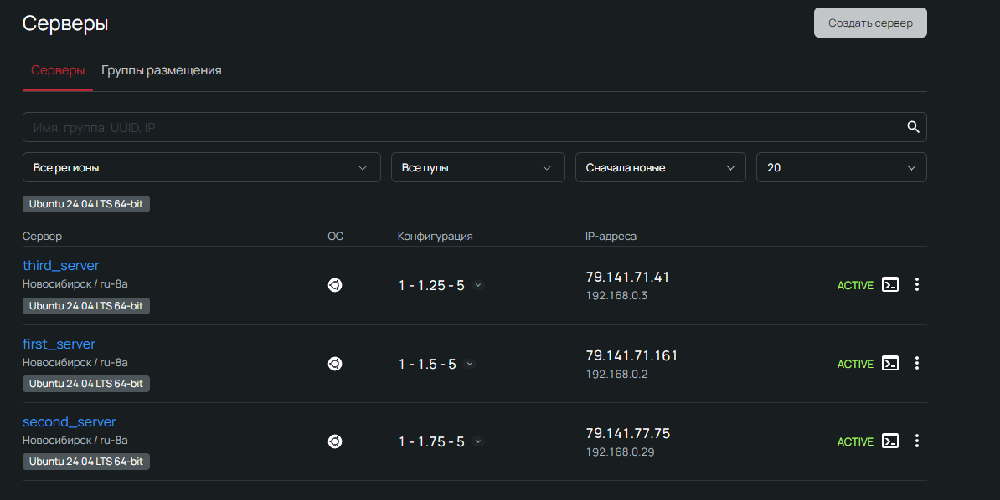
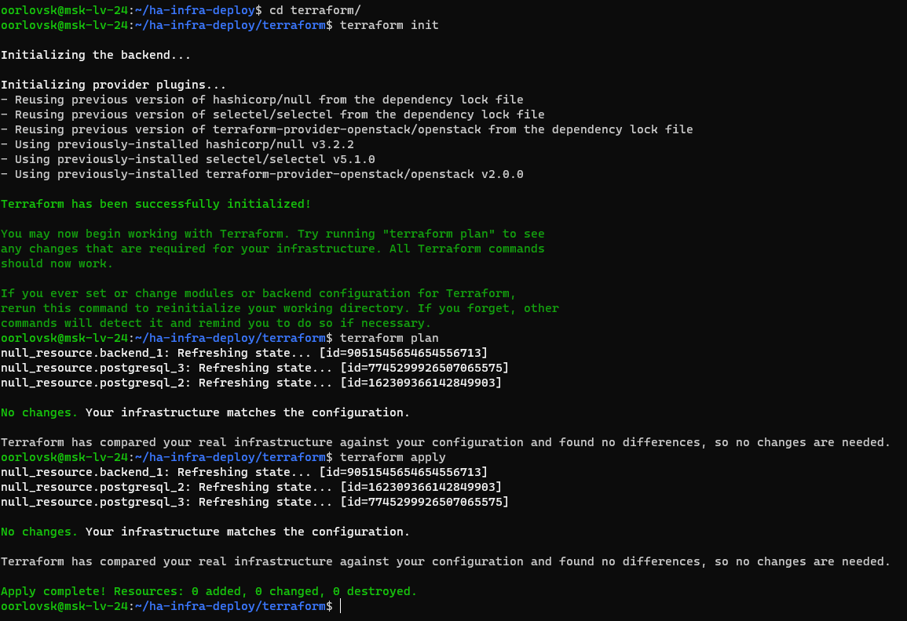
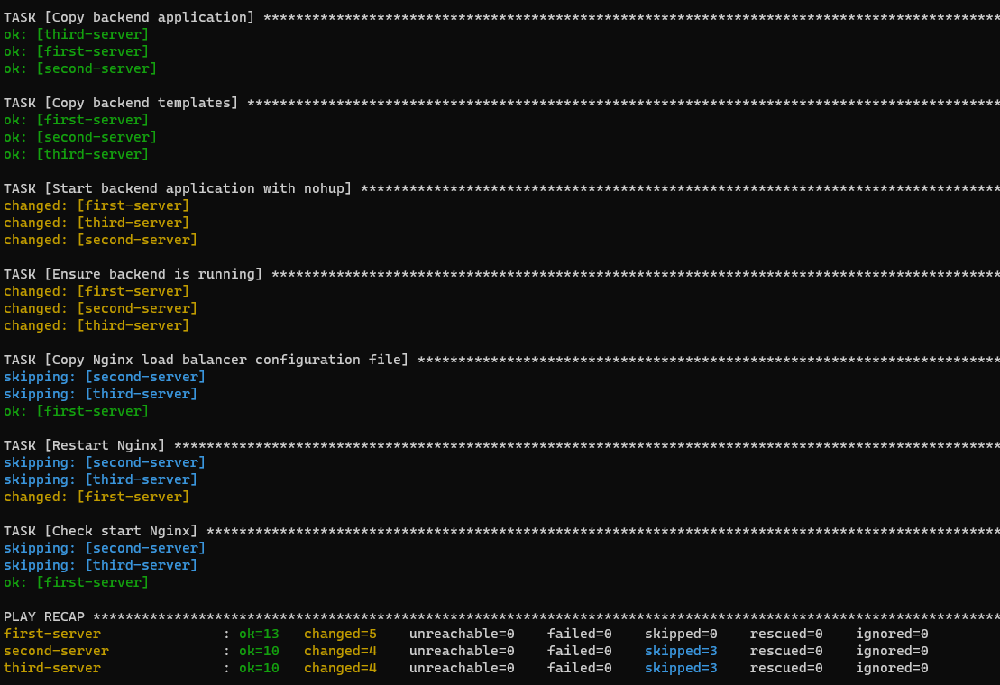
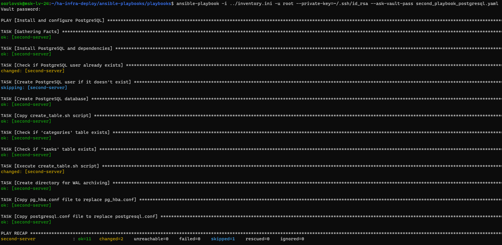
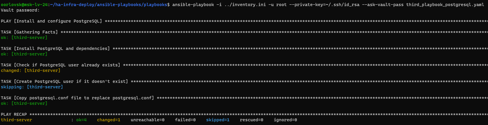
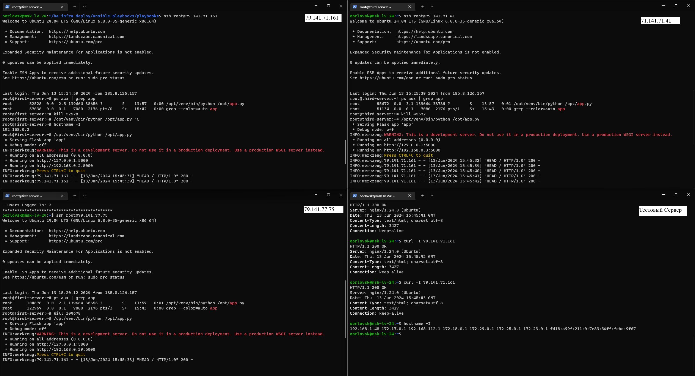
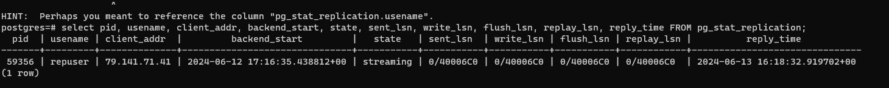
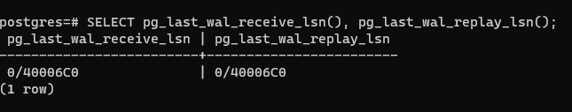
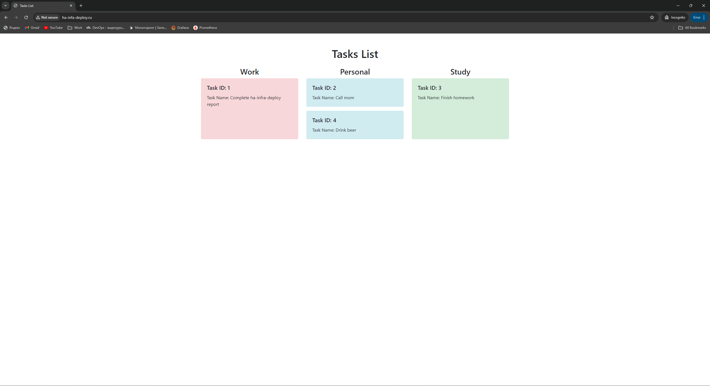

# Проект "HA Infra Deploy"

Этот проект предназначен для развертывания высокодоступной инфраструктуры с использованием Ansible и Terraform.

## Структура проекта
```
.
├── ansible-playbooks
│   ├── inventory.ini
│   ├── playbooks
│   │   ├── first_playbook.yaml
│   │   ├── second_playbook_postgresql.yaml
│   │   ├── third_playbook_postgresql.yaml
│   │   └── vault.yml
│   └── roles
│       └── nginx
│           └── templates
│               └── nginx_load_balancer.conf
├── backend
│   ├── app.py
│   └── templates
│       └── index.html
├── postgresql
│   ├── server_2
│   │   ├── create_table.sh
│   │   ├── pg_hba.conf
│   │   └── postgresql.conf
│   └── server_3
│       └── postgresql.conf
├── README.md
└── terraform
    ├── main.tf
    ├── my_vault_password.txt
    ├── terraform.tfstate
    ├── terraform.tfstate.backup
    └── variable.tf
```

## Описание структуры файлов

- **ansible-playbooks**: Директория для плэйбуков Ansible, конфига nginx и инвентари файла.
  - **inventory.ini**: Инвентарный файл для управления хостами Ansible.
  - **playbooks**: Директория с плэйбуками Ansible.
  - **roles**: Директория для ролей Ansible и конфигом nginx.
- **backend**: Директория с файлами приложения backend.
  - **app.py**: Основной файл приложения на Python.
  - **templates**: Шаблоны HTML для приложения.
- **postgresql**: Директория с конфигурационными файлами PostgreSQL для серверов.
- **terraform**: Директория с файлами Terraform для управления инфраструктурой.
  - **main.tf**: Основной файл конфигурации Terraform.
  - **my_vault_password.txt**: Файл с паролем для расшифровки зашифрованных данных в Ansible Vault. (Для работы Terraform необходимо создать файл)
  - **terraform.tfstate** и **terraform.tfstate.backup**: Файлы состояния Terraform.

## Работа приложения

### Облачные услуги
В качестве провайдера облачных услуг был выбран Selectel (настройки доступа находятся в main.tf)

### Запуск Terraform
Запускается из директории terraform/

Конфигурация прошла успешно и не показала новых изменений, т.к. после последнего запуска изменений не было.

### Ansible плэйбуки
Плэйбуки запускает Terraform, но рассмотрим запуск отдельно.  
Плэйбуки запускаются в ручном режиме из директории ansible-playbooks/playbooks, в параметрах запуска указывается инвентори файл с ролями и vault-pass с конфигурационными переменными.    
  
* Первый плэйбук устанавливает необходимые пакеты и библиотеки, а также запускает Python приложение и рестартует Nginx, на втором и третьем сервере (для распределения нагрузки) Nginx не поднят.
  
    
* Второй плэйбук устанавливает PostgreSQL, переносит конфигурационные файлы для репликации и заполняет базу данных с помощью скрипта create_table.sh (если таблицы уже созданы, то скрипт не выполняется)
 

* Третий плэйбук необходим для подготовки к репликации на третьем сервере.


### Балансировка 
В качестве сервера-балансировщика нагрузки выступает 79.141.71.161, который балансирует нагрузку между еще 2 хостами: 79.141.77.75 (Сервер с БД) и 79.141.71.41 (Сервер для репликации).

Разное количество спроксированных запросов на серверах говорит о корректной работе балансировщика с весами, заданными в конфиге Nginx

### Репликация БД
Настроенная репликация на мастере (79.141.77.75), на стендбай (79.141.71.41 - client_addr):

Настроенная репликация на стендбае (79.141.71.41):


### Доменное имя
Также было сделан домен для удобного доступа из внешней сети - [ha-infa-deploy.ru](http://ha-infa-deploy.ru/)
